# Profile Redesign — Premium Minimal

## Context

`Phantom-VK/Phantom-VK` is a GitHub profile README. It currently reads as a template: 24 rainbow shields.io badges, emoji section headers, and two stat cards that are a visual clone of `github-readme-stats` (blue `#58a6ff` accent + ambient glow). Three concrete problems make it look cheap:

1. **The cards are dark-only.** `DEFAULT_THEME` hardcodes the GitHub dark palette (`config.mjs:1-12`), so for anyone browsing GitHub in light mode the profile renders as two dark rectangles floating on white. Half of all visitors see a broken-looking page.
2. **The two cards are misaligned.** `stats.svg` is 480×299 (ratio 1.61), `top-langs.svg` is 320×283 (ratio 1.13), and `README.md:4-5` forces both to `width="49%"`. They render at different scales with mismatched heights.
3. **Badge soup.** 24 full-saturation logo chips are the single strongest "default template" signal in the file.

The goal: a restrained, monochrome, typographically-driven profile that adapts to both GitHub themes — keeping all existing information, adding featured projects, and surfacing data the fetcher already pays for but throws away.

### The key constraint

GitHub sanitizes README HTML. **`<style>` tags, `class` attributes, and `style` attributes are all stripped** (verified against the html-pipeline sanitization allowlist). You cannot style a README with CSS.

What *is* allowed: `<picture>`, `<source media>`, ``, `<div align>`, `<table>`, `<a>`, `<details>`, `<sub>`, `<br>`, `<h1>`–`<h6>`.

So all real design control lives **inside the SVGs** — and this repo already generates its own SVGs from scratch with zero dependencies. That's the leverage: we own the renderer, and CSS *inside* an SVG works fine. The README becomes a thin, semantic layout shell; the design happens in `scripts/lib/github-stats/`.

---

## Design system

Sources: Apple HIG (typography §15, simplicity/craft §16) and Emil Kowalski's design-engineering principles (motion frequency, easing, restraint).

### Type

One family, a real weight scale, **size-specific tracking** (Apple §15: large text wants negative tracking, small text positive — a single `letter-spacing` is wrong somewhere).

Replace the Windows-first `'Segoe UI', Ubuntu, Sans-Serif` with a true cross-platform system stack so each viewer gets their platform's optically-tuned face:

```
-apple-system, BlinkMacSystemFont, "Segoe UI", Roboto, "Helvetica Neue", Arial, sans-serif
```

| Role | Size / Weight | Tracking | Notes |
| --- | --- | --- | --- |
| Rank letter | 30 / 700 | `-0.02em` | tabular |
| Stat value | 15 / 600 | `-0.01em` | `font-variant-numeric: tabular-nums` |
| Stat label | 13 / 450 | `0` | |
| Eyebrow (section) | 10 / 600 | `+0.10em` | uppercase |
| Meta (score, footnote) | 10 / 450 | `+0.02em` | muted |

`tabular-nums` on every number is the craft detail that stops the right-aligned value column jittering between daily regenerations.

### Color

**Kill the blue.** `#58a6ff` plus the `ambient-glow` radial is the `github-readme-stats` signature — it is precisely what makes the cards read as a clone. Go monochrome and reserve chroma for the one place it carries meaning: language dots.

| Token | Dark | Light |
| --- | --- | --- |
| `background` | `#0B0C0E` | `#FFFFFF` |
| `surface` | `#131417` | `#FAFAFA` |
| `line` | `#23252A` | `#E6E7EA` |
| `text` | `#F2F3F5` | `#0B0C0E` |
| `muted` | `#8B9099` | `#6B7078` |
| `accent` | `#F2F3F5` | `#0B0C0E` |

**Language colors must be harmonized.** Raw GitHub linguist colors are loud and mutually clashing — the biggest obstacle to a premium look. Add `harmonizeColor(hex, theme)` to `render-shared.mjs`: convert to HSL, keep the hue (it carries recognition), clamp saturation to ~0.45, and clamp lightness into a theme-appropriate band. Recognizable, no longer garish.

### Space & layout

4px base grid. Card padding 28. **Both cards get identical intrinsic dimensions** (`440 × 300`) so the `49%`/`49%` pairing aligns perfectly — this is the direct fix for problem 2.

Drop the per-row separator lines entirely. Hierarchy comes from spacing and weight, not rules (Apple §16.6: hierarchy through order, spacing, contrast). This also sidesteps the existing invisible-separator bug.

### Motion

Emil's frequency rule: the profile owner sees this constantly, so the current reveal is too slow — stagger delays are `450 + i*150ms`, so the last row settles at ~1.8s.

- Stagger: `i * 40ms` delay, `200ms` duration (Emil: keep stagger steps 30–80ms) → fully settled in ~440ms.
- Easing: `cubic-bezier(0.23, 1, 0.32, 1)` — a strong ease-out. Never `ease-in`.
- **Add `@media (prefers-reduced-motion: reduce)`** — currently absent entirely. Opacity-only, no transform (Apple §14).
- Delete the dead keyframes (`scaleIn`, `rankSpin`, `slideIn`) and dead classes (`.rank-circle*`, `.rank-text`, `#rect-mask`, `.label`) — ~40% of the current `<style>` block is unreferenced leftovers from a previous design.

---

## Bugs to fix along the way

Found during exploration; all are cheap and all currently degrade the output:

| Bug | Location | Fix |
| --- | --- | --- |
| **Commit label lies.** Card hardcodes `"Total Commits (last year):"` but CI sets `INCLUDE_ALL_COMMITS=true`, so the number is all-time. `stats.commitWindowLabel` already holds the correct string and is never used. | `render-stats-svg.mjs:99`, `fetch-user-stats.mjs:126` | Use `stats.commitWindowLabel` |
| **Separators are invisible.** `stroke="currentColor"` with no `color` ever set → resolves to black on a near-black card. | `render-stats-svg.mjs:59` | Moot — separators are being removed |
| **Bar fill has no `width` attribute.** Width comes *only* from the `growWidth` CSS animation, so any renderer ignoring SVG CSS draws zero-width bars. | `render-top-langs-svg.mjs:41-47` | Set explicit `width`, animate `transform: scaleX()` instead |
| **Three icons are the same glyph.** `review`, `repo`, `contribs` are byte-identical paths. | `render-stats-svg.mjs:16-18` | Give each a distinct Octicon |
| **5 of 10 theme tokens unused**, several colors hardcoded as rgba literals bypassing the theme. | `config.mjs`, `render-stats-svg.mjs:66-67` | Consolidated into the new theme system |

---

## Implementation

### Phase 1 — Theme infrastructure

**New: `scripts/lib/github-stats/theme.mjs`**
- Export `THEMES = { dark, light }` using the token table above.
- Export `harmonizeColor(hex, theme)` (HSL clamp described above).
- Export `resolveTheme(name)` → falls back to `dark`.

**`config.mjs`** — theme plumbing does not currently exist. `buildRuntimeConfig` accepts `overrides.theme` but *nothing ever passes it*. Wire it up:
- Add `themeName` from `overrides.themeName ?? process.env.GITHUB_STATS_THEME`, default `"dark"`.
- Resolve via `resolveTheme()`; keep the existing shallow-merge escape hatch.
- Replace `DEFAULT_THEME` with a re-export from `theme.mjs` so there is one source of truth.

### Phase 2 — Renderer redesign

**`render-shared.mjs`** — rewrite `buildSvgDocument()`:
- New type scale + system font stack + `tabular-nums`.
- Two-theme-aware CSS driven by the passed `theme` object.
- Add the `prefers-reduced-motion` block.
- Remove the `ambient-glow` radial and all dead CSS.
- **Make DOM ids unique per card** — currently every SVG reuses `titleId`, `descId`, `ambient-glow`. Take an `idPrefix` option. (Harmless as separate `` embeds, but it is wrong and costs nothing to fix.)
- Keep `escapeXml`, `formatCompactNumber`, `formatPercent`, `truncateText`. Delete `formatNumber` (exported, imported by nobody).
- `extraDefs` is an existing, unused injection point — use it for any gradient/mask work.

**`render-stats-svg.mjs`** — relayout to `440 × 300`, no separators, restyled rank block (it is already a rounded rect, not an arc — keep that, restyle it), distinct icons, `commitWindowLabel`, tabular figures.

**`render-top-langs-svg.mjs`** — relayout to `440 × 300`, harmonized language colors, explicit bar widths with `scaleX` animation.

Both renderers are shared by the file generator *and* the dev server, so every change lands in both automatically.

### Phase 3 — Tech stack card

**New: `scripts/lib/github-stats/stack-data.mjs`** — the six groups currently encoded as badges (`README.md:18-52`), as structured data: Languages / AI & ML / Backend & Frameworks / Cloud & DevOps / Databases / Tools.

**New: `scripts/lib/github-stats/render-stack-svg.mjs`** — renders the stack as a typographic card matching the stat cards: uppercase tracked eyebrow per group, monochrome entries separated by `·`, generous leading. Full width (`900 × …`) since it spans the README.

This replaces all 24 shields.io badges — no third-party requests, no rainbow, and it finally matches the rest of the page.

### Phase 4 — Generation & output

**`generate-readme-stats.mjs`** — currently writes exactly two files. Loop over both themes and write six:

```
profile/stats-{light,dark}.svg
profile/top-langs-{light,dark}.svg
profile/stack-{light,dark}.svg
```

Fetch **once**, render six times — do not double the API calls.

**Delete** the now-stale `profile/stats.svg` and `profile/top-langs.svg`.

**`.github/workflows/readme-stats.yml:34`** — change `git add profile/*.svg` to `git add -A profile/` so the deletions of the old filenames are actually staged.

**`serve-readme-stats.mjs`** — add a `?theme=` query param and an `/api/stack` route, so all three cards are previewable in both themes locally.

**`package.json`** — `check:stats` enumerates each script file by hand; add `theme.mjs`, `stack-data.mjs`, and `render-stack-svg.mjs` or they go unchecked.

### Phase 5 — README rewrite

Allowlisted tags only. Every card gets the `<picture>` treatment:

```html
<picture>
  <source media="(prefers-color-scheme: dark)" srcset="./profile/stats-dark.svg">
  
</picture>
```

Structure:

1. **Header** — centered `<h1>` name, `<sub>` tagline. No emoji, no typing-SVG banner.
2. **Prose** — the existing two lines. Fix the typo: "Agentic AI Automatic Engineer" → "Automation".
3. **Stat cards** — the two `<picture>` blocks, side by side at 49% (now aligned, since dimensions match).
4. **Tech stack** — the new full-width stack card `<picture>`.
5. **Featured projects** *(new)* — a `<table>` of linked projects with one-line descriptions. Vyom Assist and the IEEE work are currently mentioned in Highlights but link nowhere.
6. **Highlights** — keep all three items verbatim; drop the emoji, let type hierarchy carry it.

Remove the section-header emoji (🚀 🔧 🏆 💡 📄) and normalize the `---` spacing (`README.md:61` has no preceding blank line, unlike lines 14 and 54).

Per the chosen direction, **no contact/social row** is added.

### Phase 6 — Surface discarded data

Two wins that cost zero extra API calls:

- **Top-starred repositories.** `fetch-user-stats.mjs:17-20` already fetches every repo's `{ name, stargazerCount }` ordered `STARGAZERS DESC`, then discards it after summing into `totalStars`. Return the top 3 and render them.
- **The commit-label fix** from the bug table — the correct string is already computed and thrown away.

---

## Files touched

| File | Action |
| --- | --- |
| `scripts/lib/github-stats/theme.mjs` | **new** — THEMES map, `harmonizeColor`, `resolveTheme` |
| `scripts/lib/github-stats/stack-data.mjs` | **new** — tech stack content |
| `scripts/lib/github-stats/render-stack-svg.mjs` | **new** — stack card renderer |
| `scripts/lib/github-stats/config.mjs` | theme plumbing |
| `scripts/lib/github-stats/render-shared.mjs` | rewrite `buildSvgDocument` |
| `scripts/lib/github-stats/render-stats-svg.mjs` | relayout + bug fixes |
| `scripts/lib/github-stats/render-top-langs-svg.mjs` | relayout + color harmonization |
| `scripts/lib/github-stats/fetch-user-stats.mjs` | return top repos |
| `scripts/generate-readme-stats.mjs` | 6 outputs across 2 themes |
| `scripts/serve-readme-stats.mjs` | `?theme=`, `/api/stack` |
| `package.json` | extend `check:stats` |
| `.github/workflows/readme-stats.yml` | `git add -A profile/` |
| `README.md` | full restructure |
| `profile/stats.svg`, `profile/top-langs.svg` | **delete** |

Not touched: `github-client.mjs`, `fetch-top-languages.mjs` (data layer is fine as-is).

---

## Verification

1. **Syntax** — `npm run check:stats` (must include the three new files).
2. **Generate** — `GH_TOKEN=<pat> npm run generate:stats`. Confirm exactly six SVGs in `profile/`, and that the two old filenames are gone.
3. **Both themes render** — `npm run serve:stats`, then check all six combinations:
   - `http://127.0.0.1:9000/api/stats?theme=light` and `?theme=dark`
   - same for `/api/top-langs` and `/api/stack`
4. **Theme switching works end-to-end** — open the generated files in a browser and toggle the OS light/dark setting. The `<picture>` swap is driven by `prefers-color-scheme`, so this is the real test.
5. **Alignment** — confirm `stats-*.svg` and `top-langs-*.svg` report identical `viewBox` dimensions; at `49%`/`49%` their heights must match exactly.
6. **Reduced motion** — in DevTools, emulate `prefers-reduced-motion: reduce` and confirm no transform-based motion plays.
7. **Sanitization safety** — grep the new `README.md` for `<style`, `class=`, and `style=`. All three must return zero matches, or GitHub will silently strip them.
8. **Real render** — push to a branch and view the README on GitHub. Local markdown preview does *not* reproduce GitHub's sanitizer or camo proxy, so this is the only authoritative check.
9. **Commit label** — verify the stats card reads `Commits` (not `Commits (1y)`) given `INCLUDE_ALL_COMMITS=true`.
