# Hello, I'm Vikramaditya

  
  

## 🚀 An Engineer

IT Engineer, I love computers, video games and to solve problems.
Currently working as an Agentic AI Automatic Engineer at Emplay Analytics.

---

### 🔧 Technical Stack (Jack of all trades, master of some...)

**Languages:**  

**AI / ML:**  

**Backend & Frameworks:**  

**Cloud & DevOps:**  

**Databases:**  

**Tools:**  

---

### 🏆 Highlights

- 🏆 **PSB iDEA Hackathon 2025 Winner** — Won ₹1,00,000 for Vyom Assist (AI banking assistant) among 40+ national teams, Union Bank of India
- 📄 **IEEE RCSM 2025** — Presented research paper on educational psychology-inspired neural network training, MANIT Bhopal (publication forthcoming)
- 💡 **Vice President**, SWAG Developers Club & **Co-Organizer**, GDG on Campus — led HackFusion 2.0 (75+ teams, ₹7L prize pool)
---
