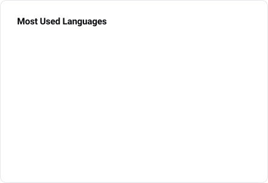

<h1 align="center">Vikramaditya Khupse</h1>

IT Engineer · Agentic AI Automation Engineer

IT Engineer, I love computers, video games and to solve problems.
Currently working as an Agentic AI Automation Engineer at Emplay Analytics.

---

<picture>
  <source media="(prefers-color-scheme: dark)" srcset="./profile/top-langs-dark.svg">
  
</picture>
<picture>
  <source media="(prefers-color-scheme: dark)" srcset="./profile/stats-dark.svg">
  
</picture>

<picture>
  <source media="(prefers-color-scheme: dark)" srcset="./profile/stack-dark.svg">
  
</picture>

---

### Featured Projects

| Project | Description |
| --- | --- |
| [Vyom Assist](https://github.com/Phantom-VK/Vyom-Assist) | AI banking assistant — PSB iDEA Hackathon 2025 winner, Union Bank of India |
| [NoRefund](https://github.com/Phantom-VK/NoRefund) | Offline LLM cost calculator and token counter with real tokenizers — nothing leaves your machine |
| [AgentTuring](https://github.com/Phantom-VK/AgentTuring) | Agentic AI that solves math problems |

---

### Highlights

- **PSB iDEA Hackathon 2025 Winner** — Won ₹1,00,000 for Vyom Assist (AI banking assistant) among 40+ national teams, Union Bank of India
- **IEEE RCSM 2025** — Presented research paper on educational psychology-inspired neural network training, MANIT Bhopal (publication forthcoming)
- **Vice President**, SWAG Developers Club & **Co-Organizer**, GDG on Campus — led HackFusion 2.0 (75+ teams, ₹7L prize pool)
